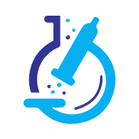

#  WellScan - Lab Tests Booking System

A comprehensive full-stack patient portal for digital health clinic enabling patients to register, browse lab tests, book appointments with intelligent scheduling, and download professional PDF reports.


## 🚀 Tech Stack

- **Frontend:** React with Vite
- **Backend:** Node.js + Express
- **Database:** MongoDB
- **Authentication:** JWT
- **Validation:** Express Validator
- **Password Hashing:** bcryptjs

## 📋 Features Implementation

### Core Requirements
- 🏥 **Patient Registration** - Form to register new patients with validation
  - Components: `RegistrationForm`, `InputField`, `ValidationMessages`
  - API: `POST /api/patients/register`

- 🧪 **Lab Tests Catalog** - Display available lab tests fetched from backend
  - Components: `TestCatalog`, `TestCard`, `LoadingSpinner`
  - API: `GET /api/tests`

- 📊 **Booking History & Reports** - View bookings and download dummy PDF reports
  - Components: `BookingHistory`, `BookingCard`, `ReportDownload`
  - API: `GET /api/bookings/:patientId`, `GET /api/reports/:bookingId`

### Bonus Features
- 🔐 **JWT Authentication** - Secure login/logout with JWT tokens
  - Components: `LoginForm`, `AuthContext`, `ProtectedRoute`
  - API: `POST /api/auth/login`, `POST /api/auth/logout`

- ✅ **Input Validation** - Frontend and backend validation with error messages
  - Components: `ValidationSchema`, `ErrorBoundary`
  - Middleware: `validateInput`, `errorHandler`

## 🛠️ Development Setup

### Prerequisites
- Node.js (>= 16.0.0)
- MongoDB (local or MongoDB Atlas)
- npm

### Current Setup

1. **Project initialized**
   ```bash
   git clone https://github.com/rohit-xo21/WellScan.git
   cd Patient-Lab-Test-Portal
   ```

2. **Dependencies installation**
   ```bash
   npm run install-deps
   ```

3. **Environment Configuration**
   ```bash
   # Copy environment template
   cp server/.env.example server/.env
   
   # Configure server/.env with:
   # MONGODB_URI=mongodb://localhost:27017/wellscan
   # JWT_SECRET=your-super-secret-key-here
   # PORT=5000
   # NODE_ENV=development
   ```

4. **Start Development**
   ```bash
   npm run dev
   ```

## 📁 Project Structure

```
├── client/              # React frontend
│   ├── src/
│   │   ├── components/  # Reusable components
│   │   ├── pages/       # Main page components
│   │   ├── services/    # API service functions
│   │   ├── contexts/    # React contexts
│   └── public/          # Static assets
├── server/              # Node.js backend
│   ├── routes/          # Express route handlers
│   ├── models/          # MongoDB schemas
│   ├── controllers/     # Route controller logic
│   ├── middleware/      # Custom middleware
│   ├── config/          # Database configuration
│   ├── utils/           # Backend utilities
│   └── uploads/         # File upload directory
└── README.md
```

## 🔗 API Endpoints

### Authentication
- `POST /api/auth/login` - Patient login
  - **Body:** `{ email: string, password: string }`
  - **Response:** JWT token and patient data

### Patients
- `POST /api/patients/register` - Register new patient
  - **Body:** `{ name: string, email: string, phone: string, dateOfBirth: date, password: string }`
  - **Response:** Patient object with JWT token

### Tests
- `GET /api/tests` - Fetch available lab tests
  - **Response:** Array of test objects with id, name, description, price

### Bookings
- `POST /api/bookings` - Book a lab test
  - **Body:** `{ patientId: string, testId: string, appointmentDate: date }`
  - **Response:** Booking confirmation object

- `GET /api/bookings/:patientId` - Get patient bookings
  - **Response:** Array of booking objects

### Reports
- `GET /api/reports/:bookingId` - Download PDF report
  - **Response:** PDF file stream

## 🗄️ Database Models

### Patient
```javascript
{
  _id: ObjectId,
  name: String (required),
  email: String (required, unique),
  phone: String (required),
  dateOfBirth: Date,
  password: String (hashed),
  createdAt: Date (default: Date.now)
}
```

### Test
```javascript
{
  _id: ObjectId,
  name: String (required),
  description: String,
  price: Number (required),
  category: String,
  duration: String
}
```

### Booking
```javascript
{
  _id: ObjectId,
  patientId: ObjectId (ref: Patient),
  testId: ObjectId (ref: Test),
  appointmentDate: Date (required),
  status: String (enum: ['scheduled', 'completed', 'cancelled']),
  reportGenerated: Boolean (default: false),
  createdAt: Date (default: Date.now)
}
```

## 🧪 Testing

Run the application and test:
- Patient registration with validation
## 🔒 Security Implementation

### Authentication & Authorization
- **JWT Tokens:** Secure token-based authentication with expiration
- **Protected Routes:** Frontend and backend route protection
- **Password Security:** bcryptjs with salt rounds (cost: 12)
- **Secure Cookies:** HTTP-only cookies for token storage

### Input Validation
- **Frontend Validation:** Real-time form validation with user feedback
- **Backend Validation:** Express-validator for comprehensive server-side validation
- **SQL Injection Prevention:** MongoDB's built-in protection and parameterized queries
- **XSS Protection:** Input sanitization and secure data handling

### Data Protection
- **Environment Variables:** Sensitive data stored in .env files
- **CORS Configuration:** Restricted origins for API access
- **File Security:** Secure PDF generation and controlled file access
- **Database Security:** Mongoose schema validation and secure connections

## 🎨 UI/UX Features

### Responsive Design
- **Mobile-First:** Optimized for mobile devices with desktop scaling
- **Tailwind CSS:** Professional styling with consistent design system
- **Interactive Elements:** Hover effects, loading states, and transitions
- **Accessibility:** Proper form labels, keyboard navigation support

### User Experience
- **Toast Notifications:** Real-time feedback for user actions
- **Loading States:** Clear loading indicators for async operations
- **Error Handling:** User-friendly error messages and recovery options
- **Navigation:** Intuitive routing with scroll-to-top functionality

### Form Management
- **Real-time Validation:** Instant feedback on form inputs
- **Error Display:** Clear error messages with field-specific guidance
- **Auto-scrolling:** Automatic scroll to top on page navigation
- **Responsive Forms:** Mobile-optimized form layouts

## 🚀 Advanced Features

### Smart Booking System
- **Duration-Based Scheduling:** Prevents appointment overlaps using test duration
- **Conflict Detection:** Intelligent time conflict resolution
- **Same-Day Booking:** Multiple different tests allowed on same day if no time conflicts
- **Professional Validation:** Business logic for realistic appointment scheduling

### PDF Report Generation
- **Professional Format:** Well-structured PDF reports with branding
- **Dynamic Content:** Patient and test-specific information
- **Secure Download:** Protected file access with proper authentication
- **Mobile Compatible:** PDF viewing optimized for all devices

### Real-time Features
- **Dynamic Updates:** Real-time data fetching and display
- **State Management:** Efficient React state management with Context API
- **Error Boundaries:** Graceful error handling to prevent app crashes
- **Performance Optimization:** Efficient rendering and data management

## 📊 Technical Architecture

### Frontend Architecture
```
client/
├── src/
│   ├── components/          # Reusable UI components
│   ├── pages/              # Route-based page components
│   ├── contexts/           # React Context for state management
│   ├── services/           # API integration layer
│   ├── assets/             # Static assets (images, logos)
```

### Backend Architecture
```
server/
├── controllers/            # Business logic handlers
├── models/                # MongoDB schema definitions
├── routes/                # API endpoint definitions
├── middleware/            # Custom middleware (auth, validation)
├── config/                # Database and environment configuration
└── utils/                 # Utility functions and helpers
```

- Lab tests catalog browsing
- Booking creation and history
- Report download functionality

## 📈 Development Progress

### Phase 1: Project Setup & Backend Foundation ✅
- Initialize project structure
- Setup Express server with basic middleware
- Configure MongoDB connection
- Create database models

### Phase 2: Core API Development ✅
- Implement patient registration endpoint
- Create tests catalog endpoint
- Build booking creation endpoint
- Add booking history endpoint

### Phase 3: Frontend Implementation ✅
- Setup React app with routing
- Create patient registration form
- Build tests catalog view
- Implement booking history page

### Phase 4: Authentication & Security ✅
- Implement JWT authentication
- Add login/logout functionality
- Protect routes with authentication
- Add input validation middleware

### Phase 5: File Handling & Polish ✅
- Implement professional PDF report generation
- Add secure file download functionality
- Improve error handling and user feedback
- Add loading states and UI polish
- Smart booking system with overlap detection
- Mobile-responsive design improvements

## 🎯 Commit Message Conventions

This project follows structured commit messages:

- **feat:** New feature implementation
- **fix:** Bug fixes
- **docs:** Documentation updates
- **style:** Code formatting/styling
- **refactor:** Code refactoring
- **test:** Adding or updating tests
- **chore:** Build process or auxiliary tool changes
- **ui:** User interface improvements

**Format:** `type: brief description in lowercase`

**Examples:**
- `feat: implement patient registration with email validation`
- `fix: resolve CORS issues in API endpoints`
- `docs: add API endpoint documentation to README`
- `ui: improve form styling and responsive design`

## 🧪 Testing Plan

## 🧪 Testing & Quality Assurance

### Backend Testing
- Test patient registration with valid/invalid data
- Verify JWT token generation and validation
- Test booking creation with overlap detection
- Validate API error handling and responses
- Test database connection and CRUD operations

### Frontend Testing
- Form validation with various input scenarios
- Responsive design testing across devices
- Navigation and routing functionality
- Error boundary and loading state testing
- Toast notification and user feedback systems

### Security Testing
- Authentication flow validation
- Protected route access testing
- Input sanitization verification
- JWT token expiration handling
- Password hashing validation


## 🏆 Project Highlights

### Technical Excellence
- **Full-Stack Proficiency:** Complete MERN stack implementation
- **Professional Standards:** Industry-standard coding practices and documentation
- **Security Focus:** Comprehensive authentication and data protection
- **Scalable Architecture:** Modular design for future feature expansion

### Innovation Features
- **Smart Scheduling:** Duration-based appointment conflict detection
- **Professional Reports:** Dynamic PDF generation with branding
- **Mobile-First Design:** Responsive UI optimized for all devices
- **Real-time Feedback:** Toast notifications and loading states

### Code Quality Metrics
- **Maintainable:** Clear structure and comprehensive documentation
- **Secure:** Multiple layers of authentication and validation
- **Responsive:** Mobile-optimized design with professional UI
- **Scalable:** Modular architecture supporting future enhancements

---

## 🎯 Quick Start

```bash
# Clone repository
git clone https://github.com/rohit-xo21/Patient_Lab_Test_Portal.git

# Install dependencies
npm install        # Root dependencies
cd client && npm install   # Frontend dependencies  
cd ../server && npm install # Backend dependencies

# Start development
npm run dev        # Start both frontend and backend
```

**Live Demo:** [WellScan Patient Portal](https://well-scan.vercel.app/)
**Backend API:** [WellScan API Server](https://wellscan.onrender.com/)


---

*Built with ❤️ by the WellScan Development Team*
- Test all API endpoints with proper responses
- Validate error handling for database operations

### Frontend Testing
- Test form submissions and validation messages
- Verify navigation between different views
- Test authentication flow (login/logout)
- Check responsive design on different screen sizes

## 🚀 Deployment Plan

### Live Application
🌐 **Frontend (Vercel):** [https://well-scan.vercel.app/](https://well-scan.vercel.app/)
🔗 **Backend API (Render):** [https://wellscan.onrender.com/](https://wellscan.onrender.com/)
📊 **Database:** MongoDB Atlas (Cloud)

### Environment Variables
```bash
MONGODB_URI=your-mongodb-connection-string
JWT_SECRET=your-jwt-secret-key
PORT=5000
NODE_ENV=production
CLIENT_URL=http://localhost:3000
```

### Deployment Targets
- **Frontend:** Vercel - [https://well-scan.vercel.app/](https://well-scan.vercel.app/)
- **Backend:** Render - [https://wellscan.onrender.com/](https://wellscan.onrender.com/)
- **Database:** MongoDB Atlas

## 📝 Development Notes

This WellScan project is being built as a demonstration of full-stack healthcare application development with modern web technologies.

